#  🤖 AI-Powered DOC/PDF → Summary Agent with FastAPI & Docker
This AI project converts **DOC/PDF documents** into clean transcripts and summaries using  **LLM Agent** with **FastAPI**, and deployment in **Docker** and log metedata (JSON) in **TinyDB**.  

**What’s next?**

**Integration with ChromaDB for vector storage, building a Q&A Agent, developing an Orchestration Agent, and deploying on AWS EC2 for scalable cloud hosting.**

**LLM Model: "openai/gpt-oss-20b"** from **Grok**
**Core Frameworks:**: Langchain, Langgraph

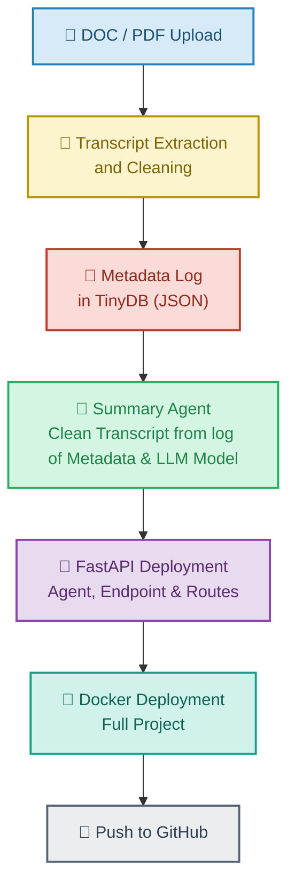
## 📂 Create Directories & Services

### 🖥️ Ubuntu Terminal Commands

##### Create directory and change directory
```sh
mkdir endpoints schemas services agents
```
```sh
cd agents
```
```sh
cd ..
```

##### Create Nano file Write Out and Exit: `Ctrl + O  >> Enter  >>  Ctrl + X`
```sh
nano main.py
```
##### Create blank files with touch under agents directory
```sh
touch  summary_agent.py 
```
## 🐍 Python Virtual Environment (pyenv + venv)
```sh
pyenv shell 3.10.8
```
```sh
python -m venv agentsenv
```

##### check the list already install
```sh
pip list
conda list
```
#####  Freeze and prepare requirement.txt all installed libraries
```sh
pip freeze > requirements.txt
```
##### Install requiremnets.txt
```sh
pip install -r requirements.txt
```

## 📝 Edit .py files

- enpoints
- agents
- services
- schemas

```sh
nano endpoints/health.py
```
## 💡 Prepare Endpoints and main.py


#### 🚀 Run FastAPI App (main.py)
```sh
uvicorn main:app --reload
```
## 📁 Project Structure

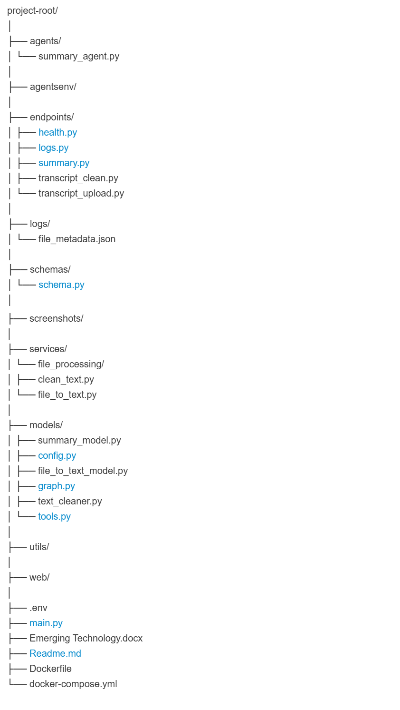


**⚠️Note:** Due to time constraint, Iconstraints, I could not complete:

- ChromaDB Integration
- Q&A Agent
- Orchestrator Agent
These require additional research and time to integrate.

## 🐳 Install Docker and Docekr Envo Setup

**📌 Link to Git Repo:** https://github.com/Shibli-Nomani/Multimodal-AI-Inference-APIs-using-FastAPI

## 🐳 Create Docker-Compose.yml and DockerFile
- Python version will based on the version I work. But I use the slim on here (`python:3.10.8-slim`)
- I listed all directories explicitly (agents, endpoints, schemas, services, models, utils, web, logs) so nothing gets missed.

## Docker Command

Go to Ubuntu Terminal and apply those command.
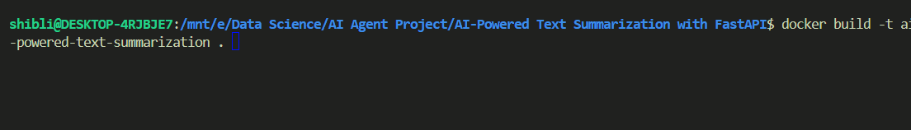

```sh
docker build -t ai-powered-text-summarization . 
```
``
```sh
docker run -d -p 8000:8000 ai-powered-text-summarization
```
## 📤 Output Results

### 🧑‍⚕️ Health  
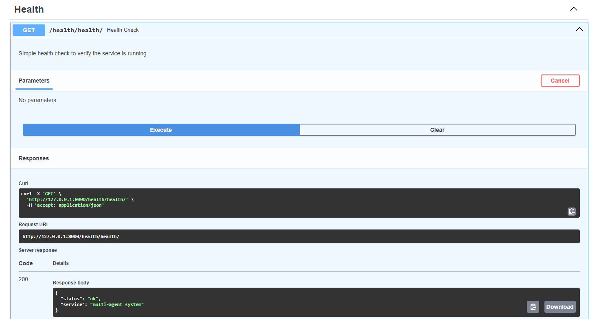

### 📜 Transcript

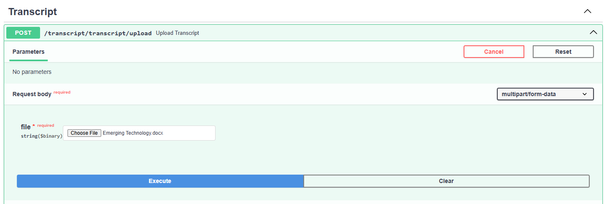
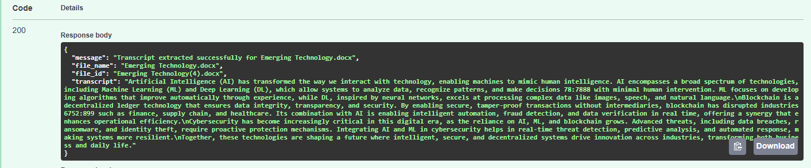

### 🧹 Clean the Transcript 
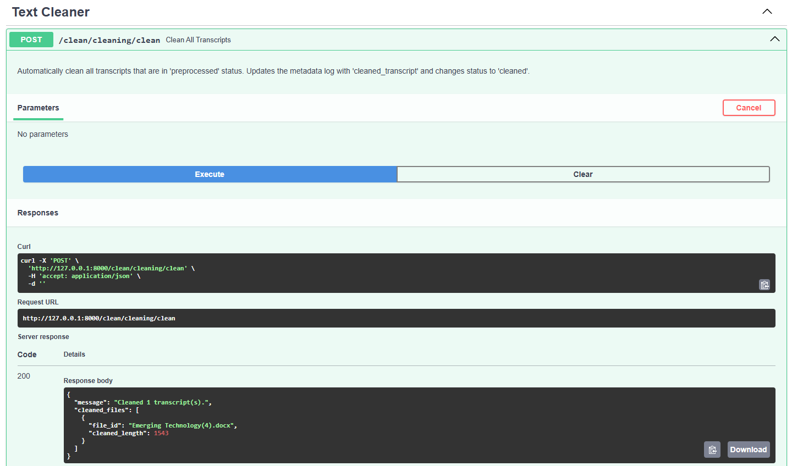

### 📁 Logs 
It has real text, size, status, transcript length, transcript, upload time, clean transcript and clean transcript length.

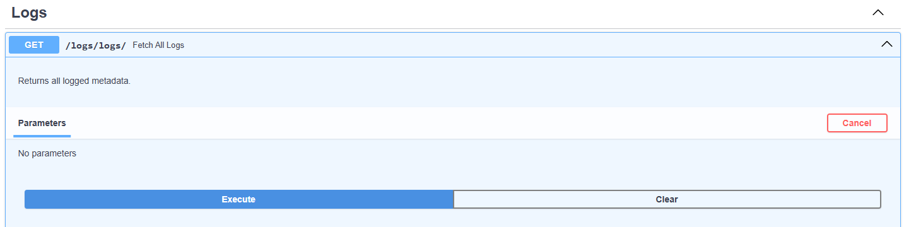
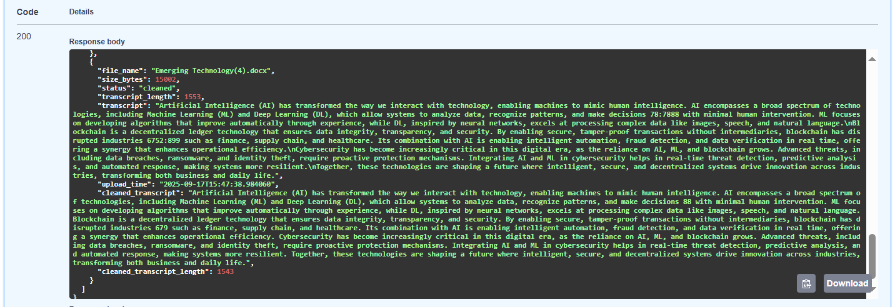

### 📝 Summary

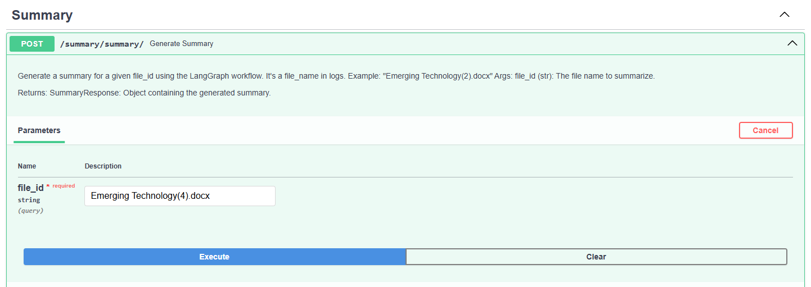
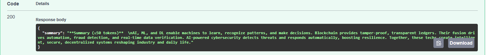

## ❌ Add .gitigore before pushing to Github
add list of files and folders which are going to ignore while pushing to github.

## 🐙 Git Initiate, Git Push and Commit
```sh
git init
```
